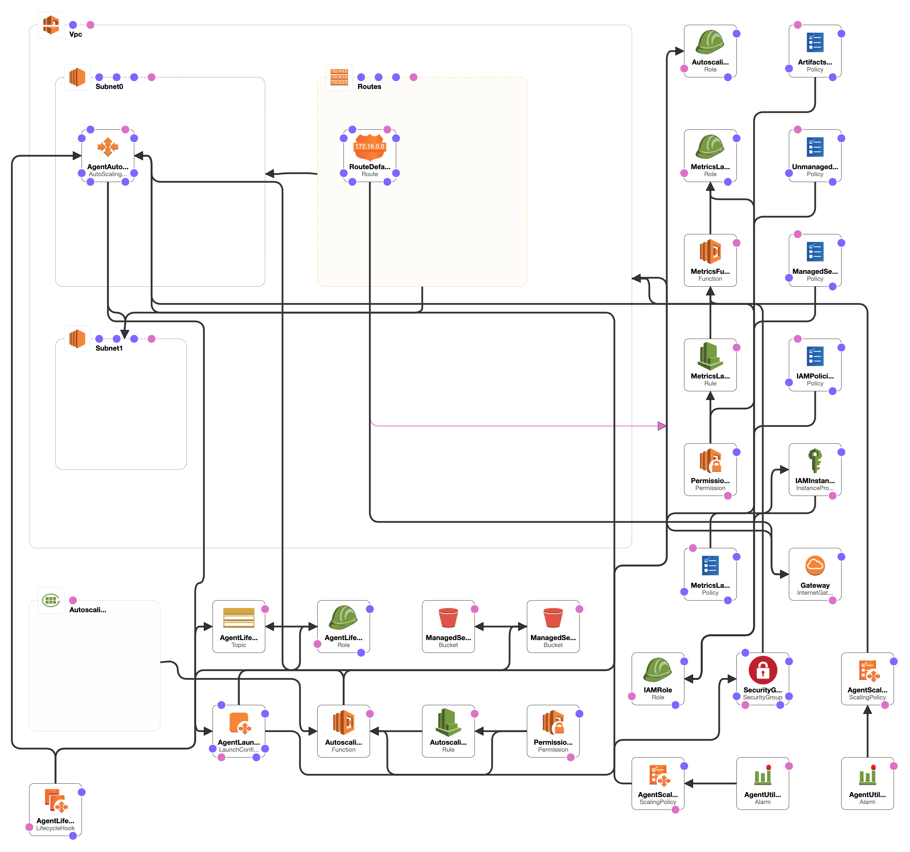

# Buildkite

Testing out Buildkite CICD.

## Overview

The cloudformation stack creates the following resources:

We're wrapping the CloudFormation stack with Terraform to make it easier to integrate with existing infrastructure.

- [CF stack](https://github.com/buildkite/elastic-ci-stack-for-aws)
- Experiments: [agent experiments](https://github.com/buildkite/agent/blob/master/EXPERIMENTS.md)
